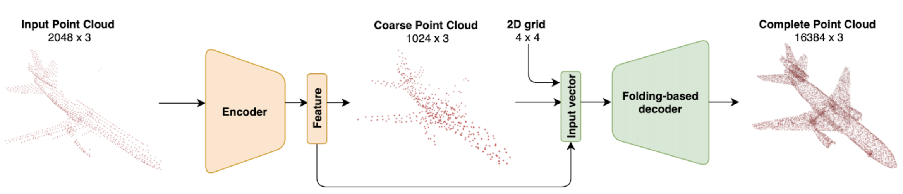

# Rotation Equivariant Point Cloud Completion using Vector Neuron

## Introduction



This is a Vector Neuron implementation of a point cloud completion pipeline in pytorch. This project is based on [PCN](https://arxiv.org/abs/1808.00671) and [PoinTr](https://arxiv.org/abs/2108.08839).

## Environment

* Ubuntu 18.04 LTS
* Python 3.7.7
* PyTorch 1.10.0
* CUDA 11.3.1

## Prerequisite

Compile for cd and emd:

```shell
cd extensions/chamfer_distance
python setup.py install
cd ../earth_movers_distance
python setup.py install
```

As for other modules, please install and create a conda environment by:

```shell
conda env create -f env.yml
conda activate VN
```

## Dataset

Please download PCN.zip from [Google Drive](https://drive.google.com/file/d/1OvvRyx02-C_DkzYiJ5stpin0mnXydHQ7/view?usp=sharing), and unzip the file under `/data` folder.

## Experiment Configuration
The training configuration is stored in `config.json`, where you can adjust common training parameters like `learning rate', 'batch size' as well as project-specific arguments. Here is the explanation of some of the key arguments in config.json:

```shell
enc_type: choose the encoder to be used in the pipeline, candidates are ["vn_pointnet", "dgcnn_fps", "vn_dgcnn_fps", "vn_pointr"]

dec_type: choose the decoder to be used in the pipeline, candidates are ["foldingnet", "vn_foldingnet" and "attention_vn_foldingnet"]

only_coarse: only train the encoder of the pipeline.

rotation: the rotation being applied during training, candidates are ['canonical', 'so3' and 'none'].

val_rotation: the rotation being applied during validation, candidates are ['canonical', 'so3' and 'none'].

test_rotation: the rotation being applied during testing, candidates are ['canonical', 'so3' and 'none'].

freeze_encoder: if true, freeze the encoder's weights.

freeze_decoder: if false, freeze the decoder's weights.

```

## Train
In order to train the model from scratch, please use script:

```shell
python main.py train
```

In order to continue training from an existing experiment, please use script:

```shell
python main.py --name <name of the experiment> --resume train
```
## Testing

In order to test the model, please use follow script:

```shell
python main.py --name <name of the experiment> --resume test
```
## Visualization
During training, a point cloud visualization of a random  sample would be produced under the `visualization` folder in the current experiment folder.

During testing, the ply and obj files will be generated automatically under the `test` folder in the current experiment folder.

## Pretrained Model

The pretrained model is in `checkpoint/`.


## Acknowledgement
We acknowledge that our work is based on PCN, PoinTr and Vector Neuron framework and this repo is based on this [PCN repo](https://github.com/qinglew/PCN-PyTorch) and this [Pointr repo](https://github.com/yuxumin/PoinTr).

* [PCN: Point Completion Network](https://arxiv.org/pdf/1808.00671.pdf)
* [PCN's official Tensorflow implementation](https://github.com/wentaoyuan/pcn)
* [PoinTr: Diverse Point Cloud Completion with Geometry-Aware Transformers](https://arxiv.org/abs/2108.08839).
* [Vector Neuron](https://arxiv.org/abs/2104.12229)
